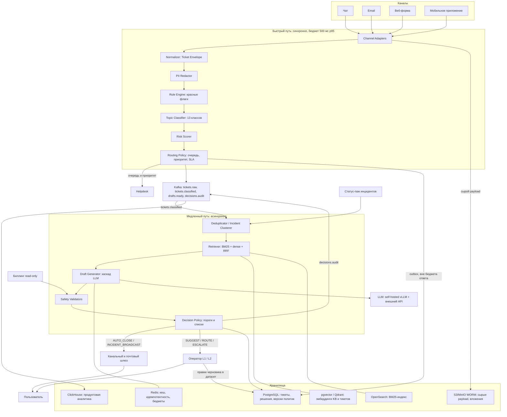
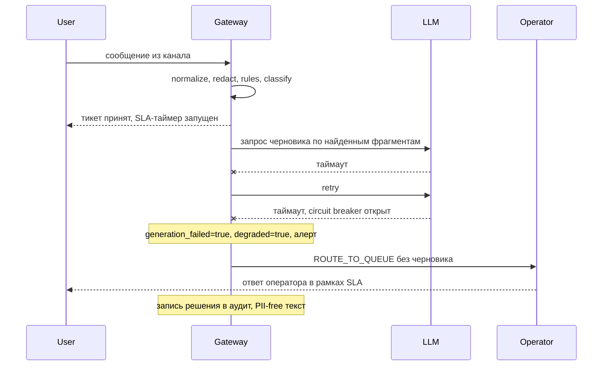

# Архитектура Triage Gateway

Документ описывает границы системы, компоненты, поток данных, разделение синхронной и
асинхронной работы, хранилища, человека в контуре и поведение под пиком. Модельная часть —
в [ml.md](ml.md), метрики и алерты — в [monitoring.md](monitoring.md), риски и эксплуатация —
в [risks-and-ops.md](risks-and-ops.md), продуктовая часть и эффект — в [product.md](product.md).
Как запустить PoC — [README](../README.md).

«PoC» — реально написанный код в `src/triage`; «целевая архитектура» — то, срезом чего PoC является. Расхождения перечислены в [§8](#8-что-в-poc-реально-а-что-дизайн).

## 1. Границы системы

Triage Gateway — сервис между каналами поддержки и helpdesk-ядром (условно Zendesk / Jira
Service Management). Он владеет решением «что это за тикет, насколько он рискованный, кому его
отдать и можно ли ответить без человека».

**Что делает:** нормализует сообщения четырёх каналов в единый Ticket Envelope; редактирует PII до того, как текст уйдёт в модель, лог или к разметчику; применяет детерминированные правила (красные флаги) и классифицирует тему; назначает очередь, приоритет и риск и отдаёт их helpdesk; асинхронно готовит черновик ответа с опорой на базу знаний; принимает версионируемое решение (автозакрытие, подсказка оператору, маршрут в очередь, эскалация, broadcast по инциденту); пишет аудируемый след каждого автоматического решения.

**Чего не делает:** не заменяет helpdesk (тикеты, SLA-таймеры, история переписки живут там), не проектирует UI оператора, не выполняет действий с деньгами и подписками, не решает вопрос о возврате, не рассылает ответы сам (это делает канальный/почтовый шлюз по команде), не хранит первичный биллинг.

**Внешние системы:**

| Система | Направление | Что берём/отдаём |
| --- | --- | --- |
| Каналы: чат, email, веб-форма, мобильное приложение | вход | сырой payload, метаданные пользователя, вложения |
| Helpdesk API | выход | тикет, очередь, приоритет, риск, черновик, решение |
| Биллинг | вход, read-only | статус платежа и подписки для фактчекинга черновика |
| Статус-паж / инцидент-менеджмент | вход, read-only | активен ли инцидент (включает инцидент-режим) |
| LLM API (внешний frontier) | выход | генерация только по PII-free тексту, только хвост каскада |
| Почтовый шлюз | выход | отправка ответа по email-каналу |

## 2. Схема компонентов

## 3. Поток данных: от входящего тикета до ответа

Быстрый путь (в PoC — `TriagePipeline.fast_path()`):

1. **Приём и адаптация.** PoC: `RawMessage` четырёх каналов. Продакшен: `Channel Adapters` — вебхуки чата и мобильного, IMAP/SMTP-коннектор, HTTP-форма; идемпотентность по внешнему id через Redis, сырой payload в S3.
2. **Нормализация.** PoC: `normalizer.normalize()` → Ticket Envelope (текст, канал, язык, вложения, `repeat_contact`, признаки аккаунта). Продакшен: то же плюс расшивка email-цитирования, HTML→текст, детект языка, склейка тредов.
3. **PII-редакция.** PoC: `pii.redact()` — email, телефон, PAN с проверкой Luhn, паспорт, СНИЛС, ИНН, 20-значный счёт, адрес, IP, CVV; классы найденных сущностей остаются в конверте. Продакшен: те же правила плюс DLP на исходящей почте. Ключевое свойство: дальше по конвейеру идёт только отредактированный текст.
4. **Правила.** PoC: `rules.evaluate()` — красные флаги (суд, регулятор, «взломали», «списали деньги», здоровье, VIP) дают `risk`, принудительную очередь и флаг `deny_auto_close`. Здесь же, до всякой генерации, текст обращения проверяется на prompt injection: срабатывание даёт риск HIGH, запрещает автозакрытие и запрещает отправку текста во внешний контур (`block_external_llm`). Проверка стоит именно на входе, потому что атака направлена на генератор — останавливать её после генерации поздно.
5. **Классификация темы.** PoC: `classifier` — TF-IDF char n-grams + центроид, косинус как `confidence`. Продакшен: e5-small (ONNX int8) + линейная голова с temperature scaling, на выходе калиброванная вероятность.
6. **Риск и маршрут.** PoC: риск целиком из правил, маршрут вычисляется позже в `policy.decide()`. Продакшен: отдельный `Risk Scorer` (правила + модель) и `Routing Policy` на горячем пути — helpdesk получает очередь, приоритет и SLA-таймер синхронно.

Медленный путь (в PoC — `TriagePipeline.slow_path()`, вход — результат быстрого):

7. **Дедупликация и инциденты.** PoC: `dedup.IncidentDetector` — кластеризация near-duplicate по Jaccard на шинглах, кластер помечается инцидентом по размеру. Продакшен: онлайн-кластеризация в стриме (Flink/Faust) плюс подтверждение по статус-пажу.
8. **Поиск опоры.** PoC: `retrieval.KnowledgeBase` — TF-IDF по словам, 8 md-статей, у каждой флаг `auto_reply_allowed`; берём top-3. Продакшен: гибрид BM25 + dense + RRF по 400–800 статьям и корпусу решённых тикетов, cross-encoder-reranker на top-20.
9. **Генерация черновика.** PoC: `llm` — `TemplateLLM` под `GuardedLLM` с таймаутом, retry и `CircuitBreaker`. Продакшен: каскад self-hosted Qwen3-8B (vLLM) → внешний API на остатке. Генерации не будет вообще в двух случаях: `risk == CRITICAL` и пустой результат поиска. По критичным тикетам LLM не вызывается сознательно — это экономия токенов и, важнее, отсутствие подсказки, способной исказить решение оператора.
10. **Валидаторы безопасности.** PoC: `safety.validate()` — groundedness (доля утверждений, подтверждённых найденными фрагментами), PII в черновике, маркеры prompt injection, обещания денежных операций. Продакшен: то же плюс NLI-модель для groundedness и сверка фактов с биллингом.
11. **Решение.** PoC и продакшен: `policy.decide()`, порядок фиксирован —
    (1) `risk == CRITICAL` → `ESCALATE_L2`, черновик не создаётся;
    (2) черновика нет → `ROUTE_TO_QUEUE`, причём различаются `generation_failed` (деградация LLM,
    идёт в алерты) и сознательный отказ генерировать (деградацией не считается);
    (3) валидаторы не прошли → `SUGGEST_TO_OPERATOR` с черновиком и списком нарушений;
    (4) подтверждённый инцидент и тема `tech.service_unavailable` → `INCIDENT_BROADCAST`;
    (5) все пороги пройдены → `AUTO_CLOSE`;
    (6) иначе `SUGGEST_TO_OPERATOR`, а конкретные блокеры перечислены в `reasons`.
12. **Аудит.** PoC: `audit.AuditLog` — append-only JSONL с hash-chain (tamper-evident). Пишутся уже отредактированный (PII-free) текст, версии политики и модели, сработавшие правила, уверенность, id найденных документов, `retrieval_top_score`, решение и очередь. Продакшен: append-only таблица в PostgreSQL + выгрузка в WORM-бакет, топик `decisions.audit` в Kafka.

**Бюджет 500 мс p95 по стадиям быстрого пути (целевые значения, не измеренные):**

| Стадия | Бюджет |
| --- | --- |
| Нормализация | 15 мс |
| PII-редакция | 10 мс |
| Правила | 5 мс |
| Эмбеддинг (ONNX, CPU) | 120 мс |
| Голова классификатора | 2 мс |
| Risk + Policy | 8 мс |
| Публикация события | 20 мс |
| Сеть и сериализация | 60 мс |
| **Итого** | **~240 мс, запас 2× на хвосты** |

Запись в PostgreSQL в бюджет не входит: она уходит через outbox. Быстрый путь PoC измеренно занимает ~1–2 мс на тикет (нет эмбеддера и сетевых вызовов, TF-IDF на 39 обучающих примерах); значение возвращается в `FastPathResult.latency_ms` и попадает в аудит, так что бюджет контролируется тем же кодом, а не отдельным бенчмарком.

## 4. Синхронное и асинхронное

| Операция | Режим | Почему так | Что при отказе |
| --- | --- | --- | --- |
| Приём и ACK каналу | синхронно | канал ждёт подтверждения, иначе ретраит и дублирует | 5xx каналу, ретрай по идемпотентному ключу |
| Нормализация, PII-редакция, правила | синхронно | всё дальнейшее (лог, модель, разметка) обязано видеть PII-free текст | fail-closed: тикет уходит в `L1_general` без классификации |
| Классификация и risk | синхронно | от них зависят очередь, приоритет и SLA-таймер | rules-only routing в `L1_general`, приоритет по каналу |
| Выдача очереди в helpdesk | синхронно | это и есть продукт горячего пути | ретрай с backoff, тикет остаётся в `tickets.raw` |
| Публикация `tickets.classified` | синхронно, 20 мс бюджета | без события не запустится медленный путь | локальный outbox, дослать позже |
| Запись в PostgreSQL | асинхронно (outbox) | ответ каналу не зависит от коммита; хвосты БД (блокировки, репликация, вакуум) непредсказуемы и съели бы весь запас бюджета | восстановление из `tickets.raw` и сырых payload в S3 |
| Дедупликация, retrieval, генерация, safety, решение | асинхронно | см. ниже | тикет остаётся в очереди, лаг растёт, данные не теряются |
| Отправка ответа пользователю | асинхронно | зависит от решения политики и внешнего шлюза | ретрай, при исчерпании — оператору |
| Индексация KB и эмбеддингов, ClickHouse | асинхронно, батчами | не на критическом пути | отставание индекса, деградация качества поиска, не отказ |

**Почему генерация не может быть синхронной.** Черновик — это ~1800 входных и ~350 выходных токенов; даже на self-hosted это единицы секунд, плюс retry, плюс возможная эскалация каскада во внешний API с неконтролируемым нами хвостом — на порядок больше 500 мс. Целевой SLA первого ответа 15 минут делает задержку в секунды-минуты продуктово безопасной, а срыв горячего пути — нет. Разделение путей очередью даёт и естественную точку shed'а: маршрутизация продолжает работать, когда генерация уже не успевает.

## 5. Хранилища

| Хранилище | Что лежит | Почему именно оно | Retention |
| --- | --- | --- | --- |
| PostgreSQL | тикеты, решения, версии политик и моделей, правки операторов | source of truth, транзакции, append-only аудит с ссылочной целостностью | по политике продукта, аудит — не удаляется |
| pgvector (MVP) → Qdrant (при росте) | эмбеддинги KB-статей и решённых тикетов | на MVP не нужен отдельный сервис; при росте корпуса нужны фильтры и шардирование | пересобирается при смене эмбеддера |
| OpenSearch | BM25-индекс KB и тикетов | лексическая половина гибридного поиска; точные совпадения кодов ошибок и артикулов dense-модель теряет | переиндексация по расписанию |
| Redis | кеш ответов по семантическому хешу, идемпотентность, rate-limit, счётчики бюджета LLM | нужны миллисекундные счётчики с TTL, персистентность не требуется | TTL: кеш часы, идемпотентность сутки |
| S3/MinIO (WORM) | сырые payload каналов, вложения | восстановление после сбоя конвейера и доказательство «что пришло на вход» | 90 дней |
| Kafka | `tickets.raw`, `tickets.classified`, `drafts.ready`, `decisions.audit` | разделяет пути, поглощает пик как буфер, даёт replay | 7 дней (assumption) |
| ClickHouse | продуктовая аналитика и метрики, материализуется из Kafka | агрегаты по десяткам миллионов тикетов не должны конкурировать с OLTP | 13 месяцев (assumption) |

## 6. Человек в контуре и запасные пути

Три режима, включаются последовательно (план раскатки — в [product.md](product.md)):

- **shadow** — система считает решение, но ничего не делает; оператор работает как раньше, пользователь ничего не замечает. Смысл: измерить согласие с оператором до включения.
- **suggest** — оператор видит черновик, цитаты из KB и причины решения; может отправить, исправить или отклонить. Пользователь получает ответ от человека. Правки идут в датасет.
- **auto-close** — только allowlist-категории и только при всех пройденных порогах; пользователь получает ответ сразу, оператор видит тикет в отчёте автозакрытых и может его переоткрыть.

Порогов «И», а не «ИЛИ»: `MIN_CONFIDENCE_AUTO_CLOSE = 0.90`, `MIN_GROUNDEDNESS_AUTO_CLOSE = 0.75`,
`MIN_RETRIEVAL_SCORE` (0.35 в PoC, 0.55 в целевой архитектуре — см. [§8](#8-что-в-poc-реально-а-что-дизайн)),
`MAX_REPEAT_CONTACT = 3`. Одного несработавшего условия достаточно, чтобы тикет ушёл человеку.

**Запасные пути:**

1. **LLM недоступен.** Таймаут → retry → circuit breaker. Черновика нет, `generation_failed`
   поднимает флаг деградации; тикет идёт `ROUTE_TO_QUEUE`. Пользователь: ответ от оператора,
   SLA-таймер не сброшен. Оператор: тикет без черновика с пометкой `llm_unavailable_no_draft`.
   Альтернатива для простейших тем — шаблонный ответ по KB-статье без генерации.
2. **Классификатор деградировал.** Rules-only routing в `L1_general`, приоритет по каналу.
   Пользователь: разницы не видит. Оператор: тикет без темы и без черновика, пометка
   `low_confidence`.
3. **Retriever недоступен или ничего не нашёл.** Генерировать без опоры запрещено: черновика нет,
   это не деградация, а нормальная работа политики (`no_draft_no_context`). Пользователь: ответ
   оператора. Оператор: тикет в очереди по теме.
4. **Пик нагрузки.** Быстрый путь автоскейлится (stateless), медленный копит лаг в Kafka; при
   лаге больше порога черновики генерируются только для топ-категорий инцидента. Пользователь:
   маршрутизация как обычно, черновики — не для всех. Оператор: рост доли тикетов без черновика.
5. **Инцидент-режим.** Дедупликация собирает кластер, `INCIDENT_BROADCAST` даёт один ответ на
   кластер вместо N генераций. Пользователь: ответ по факту инцидента со ссылкой на статус-паж.
   Оператор: один кластер вместо тысяч однотипных тикетов.

## 7. Масштабирование под пик инцидента

Baseline — ~2.3 тикета/с (200k в сутки), пик инцидента — 10–20k тикетов за 10 минут, то есть до
~33 тикетов/с, примерно 14× от baseline при почти полностью однотипном содержимом.

- **Скейлится горизонтально:** Channel Adapters и весь быстрый путь — stateless, HPA по RPS и
  p95-латентности; эмбеддер на CPU-репликах, ONNX int8, батчирование внутри реплики.
  Цель — не потерять 500 мс на маршрутизации, потому что распределение по очередям и приоритеты
  нужны операторам именно в момент пика.
- **Копит лаг:** медленный путь. Consumer group по `tickets.classified` держит фиксированную
  пропускную способность генерации; Kafka работает буфером. Лаг — управляемая метрика, а не
  авария: SLA первого ответа 15 минут даёт запас.
- **Дедупликация включается на входе медленного пути**, до retrieval и генерации, иначе мы
  оплатим 20k генераций об одном и том же. Кластер подтверждается размером и внешним статус-пажем;
  подтверждённый кластер по теме `tech.service_unavailable` уходит в `INCIDENT_BROADCAST` —
  один текст на кластер, дальше рассылка по списку.
- **Shed нагрузки:** при лаге выше порога генерация остаётся только для топ-категорий инцидента,
  остальное маршрутизируется без черновика. Деградирует полнота черновиков, не маршрутизация.
- **Стоимость удерживается** тремя механизмами: broadcast вместо N генераций, кеш по
  семантическому хешу в Redis (в пике доля попаданий максимальна, потому что тексты почти
  одинаковые), счётчики бюджета токенов — при их исчерпании каскад остаётся на self-hosted и
  не уходит во внешний API. По критичным тикетам LLM не вызывается вообще.

## 8. Что в PoC реально, а что дизайн

| Компонент | В PoC | В целевой архитектуре |
| --- | --- | --- |
| Каналы и нормализация | 4 канала → Ticket Envelope (`normalizer`) | те же адаптеры + IMAP/вебхуки, HTML→текст, склейка тредов |
| PII-редакция | regex/Luhn (`pii`) | те же правила + DLP на исходящей почте, KMS |
| Правила | `rules`, красные флаги | то же + словари, версионируемые как политика |
| Классификатор темы | TF-IDF char n-grams + центроид на 39 примерах, holdout 15 | e5-small (ONNX int8) + LogReg, temperature scaling |
| `confidence` | косинус к центроиду, некалиброванный | калиброванная вероятность `p_topic` |
| Risk Scorer | только правила, отдельного скорера нет | правила + модель, отдельный компонент горячего пути |
| Место принятия маршрута | `policy.decide()` вызывается на медленном пути | Routing Policy на горячем пути, Decision Policy — на медленном |
| Retrieval | TF-IDF по словам, 8 md-статей + флаг `auto_reply_allowed` | BM25 + dense + RRF + reranker, 400–800 статей и ~1.5 млн тикетов |
| Дедупликация | in-memory Jaccard по шинглам (`dedup`) | онлайн-кластеризация в Flink/Faust + статус-паж |
| LLM | `TemplateLLM` под `GuardedLLM` + `CircuitBreaker` | каскад vLLM Qwen3-8B → внешний API |
| Safety | groundedness по пересечению, PII, injection, обещания денег | NLI-groundedness, сверка с биллингом, safety-suite в CI |
| Очередь между путями | обычный вызов `slow_path()` после `fast_path()` | Kafka, 4 топика, consumer groups, replay |
| Аудит | JSONL с hash-chain (`audit`) | PostgreSQL append-only + WORM S3 + `decisions.audit` |
| Хранилища | файлы в каталоге данных | PostgreSQL, pgvector/Qdrant, OpenSearch, Redis, S3, ClickHouse |
| Масштабирование | нет | HPA, партиционирование Kafka, shed по лагу |
| SLA/приоритет, helpdesk, UI оператора | нет | интеграция с helpdesk API |

**Известные расхождения между PoC и целевой архитектурой, которые нельзя читать как ошибку:**

- `MIN_RETRIEVAL_SCORE = 0.35` в PoC против 0.55 в целевой архитектуре ([ml.md](ml.md), §4
  политики). Порог отсечения — свойство конкретного ретривера, а не универсальная константа:
  у TF-IDF-косинуса другое распределение оценок, чем у гибрида BM25 + dense + RRF. При замене
  ретривера порог пересчитывается по разметке «релевантно/нет» под целевой precision, иначе он
  либо режет всё, либо не режет ничего. Пороги `0.90` и `0.75` от ретривера не зависят и совпадают.
- Проверка `risk == LOW` в PoC выражена не прямым сравнением, а флагом `rules.deny_auto_close`:
  правила, поднимающие риск выше LOW, одновременно ставят этот флаг. Поведение эквивалентно,
  но в целевой реализации условие должно быть явным, иначе новое правило легко забудет флаг.
- Блокер `kb_article_manual_only` (флаг `auto_reply_allowed` у KB-статьи) есть в коде PoC, но
  отсутствует в списке порогов §4 политики. Это осознанное усиление: редактор KB может запретить
  автоответ по конкретной статье, не меняя код и пороги.
- Ветка `INCIDENT_BROADCAST` возвращается до проверки списка блокеров, то есть не требует
  прохождения порогов уверенности и groundedness. Основание для ответа здесь — подтверждённый
  инцидент и фиксированный шаблон, а не решение модели; ограничением остаётся `deny_auto_close`.
