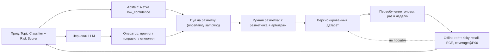

# ML/LLM-дизайн Triage Gateway

Документ отвечает на один вопрос: **где в системе нужна модель, где хватит правил, и почему именно так**.
Компоненты и потоки данных описаны в [architecture.md](architecture.md), метрики эксплуатации — в
[monitoring.md](monitoring.md); здесь они не дублируются.

Все числовые значения качества ниже — **целевые пороги приёмки, а не измеренные результаты**.
На момент сдачи PoC ни одна модель не обучена на реальных данных (см. §12).

---

## 1. Карта ML/LLM-задач

Быстрый путь — синхронный, бюджет 500 мс p95 на тикет. Медленный путь — асинхронный, за очередью Kafka
`tickets.classified`.

| Задача | Подход | Почему так | Где в пайплайне | Латентность / бюджет |
|---|---|---|---|---|
| Парсинг и нормализация 4 каналов | Парсеры + правила | Формат детерминирован, ML не даёт ничего | `Normalizer`, быстрый | 15 мс |
| Детект языка | Словари/статистика символов | Нужен один ответ, а не вероятность | `Normalizer`, быстрый | входит в 15 мс |
| Редакция PII | Regex + словари + Luhn для PAN | Нужна полнота и воспроизводимость, юридическое требование | `PII Redactor`, быстрый | 10 мс |
| Красные флаги (суд, РКН, «взломали», «списали деньги», карта) | Regex/словари | Аудируемость, объяснимость решения построчно | `Rule Engine`, быстрый | 5 мс |
| Детект инцидент-режима | Чтение внешнего статус-пажа | Факт, а не предсказание | `Rule Engine`, быстрый | кешируется, ~0 мс |
| Тема тикета (13 классов) | Эмбеддинги (ONNX int8) + LogReg / LinearSVC | Дёшево, калибруемо, переобучается за минуты | `Topic Classifier`, быстрый | 120 мс embed + 2 мс голова |
| Risk score (`LOW…CRITICAL`) | Правила задают нижнюю границу, линейная модель уточняет | Правила дают гарантии, модель — градацию внутри | `Risk Scorer`, быстрый | 8 мс вместе с политикой |
| Маршрутизация (`Route enum`) | Детерминированная политика по числам | Решение должно объясняться в аудите таблицей порогов | `Routing Policy`, быстрый | входит в 8 мс |
| Дедупликация / кластеризация инцидента | Шинглы + порог похожести (MinHash при росте) | Нужна скорость и предсказуемость на всплеске 33 тикета/с | `Deduplicator`, медленный | Assumption: ≤ 50 мс на тикет |
| Поиск опоры для ответа | Гибрид BM25 + dense e5-small + RRF | Лексика (коды ошибок, номера тарифов) и семантика ловят разное | `Retriever`, медленный | Assumption: p95 ≤ 300 мс |
| Переранжирование | Cross-encoder `bge-reranker-base`, только топ-20 | Дорого; оправдано только там, где нет бюджета 500 мс | `Retriever`, медленный | Assumption: 150–400 мс на 20 пар |
| Черновик ответа | LLM, каскад Qwen3-8B → внешний frontier-API | Свободный текст на естественном языке — единственная задача, где LLM незаменим | `Draft Generator`, медленный | Assumption: p95 ≤ 12 с |
| Суммаризация диалога для оператора | LLM (self-hosted) | Сжатие длинной переписки, шаблоном не решается | `Draft Generator`, медленный | Assumption: p95 ≤ 5 с |
| Извлечение сущностей из свободного текста | LLM + regex для форматных полей (номер заказа, сумма) | Форматное — правилами, размытое («вчера вечером») — LLM | `Draft Generator`, медленный | входит в бюджет черновика |
| Groundedness черновика | NLI/сверка цитат + правила | Проверка обязательна и должна быть строже генератора | `Safety Validators`, медленный | Assumption: ≤ 500 мс |
| PII и prompt-injection в черновике | Правила (те же, что на входе) | Ноль пропусков важнее полноты покрытия формулировок | `Safety Validators`, медленный | ≤ 20 мс |
| Решение auto-close / suggest / escalate | Пороговая политика §4, `policy_version` | Решение должно быть воспроизводимо задним числом | `Decision Policy`, медленный | ≤ 5 мс |
| Семантический кеш ответов | Эмбеддинг + порог косинуса, Redis | Инцидентный трафик однороден, кеш снимает основную стоимость | между путями | ≤ 5 мс на lookup |

Итог по бюджету быстрого пути (p95, целевой): 240 мс расчётной суммы против лимита 500 мс — запас 2×
на хвосты. Запись в PostgreSQL идёт через outbox и в бюджет ответа не входит.

---

## 2. Что решается правилами, без ML

| Что | Почему правилами |
|---|---|
| PII-редакция (email, телефон, PAN+Luhn, паспорт, СНИЛС, ИНН, IBAN, адрес, IP) | Юридическое требование: пропуск PII во внешний LLM-API — инцидент, а не «падение метрики». Правило можно доказать построчно, модель — только статистически |
| Красные флаги и hard deny для автозакрытия | Список запретов (`fraud.unauthorized_charge`, `legal.complaint_threat`, `account.data_deletion`, `billing.refund_request`, здоровье/угроза жизни, несовершеннолетние, суд/регулятор/СМИ, VIP, repeat ≥ 3) должен работать при полностью деградированном ML |
| Маршрутизация и приоритет SLA | Приоритет — управленческое решение бизнеса, а не предсказание. Меняется приказом, а не переобучением |
| Расчёт сумм, возвратов, сроков | Арифметика и условия договора. Ошибка = финансовый ущерб; вероятностная модель здесь неприемлема |
| Детект инцидент-режима | Читаем факт из статус-пажа. Предсказывать то, что известно точно, — лишний источник ошибок |

Общие причины: **детерминированность** (одинаковый вход → одинаковый выход, всегда),
**аудируемость** (в `Decision Log` пишется сработавшее правило, а не «модель сказала 0.83»),
**юридические требования** (152-ФЗ/GDPR по `account.data_deletion`), **стоимость ~0 мс**
и работоспособность при отказе всех ML-компонентов (fallback: rules-only routing в `L1_general`).

---

## 3. Где уместна классическая ML-модель

Две задачи: **тема (13 классов)** и **risk-score**.

| Свойство | Решение |
|---|---|
| Признаки | Эмбеддинг нормализованного (PII-free) текста тикета + канал + длина + наличие вложений |
| Модель | Логистическая регрессия (основной) / LinearSVC (сравнение). Голова обучается внутри |
| Калибровка | Temperature scaling на отдельном калибровочном сплите; без калибровки порог `p_topic ≥ 0.90` не имеет смысла |
| Инференс | ONNX Runtime, int8, CPU; голова — одно матричное умножение (2 мс) |
| Переобучение | Раз в неделю на данных feedback loop; версия головы пишется в `Decision Log` |
| risk-score | Правила задают floor (`CRITICAL` от красного флага не понижается моделью). Assumption: модель уточняет уровень только вверх, вниз — никогда |

Почему не трансформер end-to-end на горячем пути: бюджет 500 мс, всплески до 33 тикетов/с, требование
калиброванных вероятностей и требование пересобирать модель за минуты после правки таксономии. Линейная
голова над фиксированным эмбеддером даёт всё это; дообучение энкодера — ступень (4) лестницы и включается
только по критерию из §7.

---

## 4. Где нужны embeddings и retrieval

Черновик ответа генерируется **только с опорой на найденный источник**. Если `Retriever` недоступен —
черновик не генерируется вовсе (запасной путь 3).

| Компонент | Что делает | Где |
|---|---|---|
| BM25 (OpenSearch) | Лексический поиск: коды ошибок, названия тарифов, артикулы, редкие термины | медленный путь |
| Dense (`intfloat/multilingual-e5-small`, 118M) | Семантика: пользователь описывает проблему своими словами | медленный путь |
| RRF | Слияние двух списков без обучаемых весов и без калибровки скоров | медленный путь |
| `bge-reranker-base` (cross-encoder) | Переранжирование **топ-20** | только медленный путь |
| pgvector (MVP) → Qdrant | Хранение векторов | — |

Корпус: **400–800 KB-статей + ~1.5 млн решённых тикетов за 12 месяцев**. Решённые тикеты нужны, потому
что KB покрывает регламент, а тикеты — реальные формулировки и фактические решения.

Reranker сознательно не ставится на быстрый путь: cross-encoder на 20 парах не укладывается в 500 мс и
не нужен для выбора очереди — там решает классификатор.

Порог `retrieval_top1_score ≥ 0.55` — часть условий автозакрытия (§4 политики): слабая опора означает,
что генерировать нечего. Значение 0.55 относится к целевому гибридному ретриверу; в PoC порог
откалиброван под TF-IDF-пространство и равен 0.35, потому что порог отсечения — свойство конкретного
ретривера, а не универсальная константа (см. [architecture.md](architecture.md), §8).

---

## 5. Где нужен LLM

Три задачи, все на медленном пути:

1. **Черновик ответа** с опорой на найденные фрагменты KB / похожие решённые тикеты.
2. **Суммаризация диалога** для оператора (переписка → 3–5 строк контекста).
3. **Извлечение сущностей** из свободного текста, где regex бессилен.

Каскад:

| Ступень | Модель | Доля объёма | Когда |
|---|---|---|---|
| 1 | Self-hosted Qwen3-8B (vLLM) | ~85% черновиков | по умолчанию |
| 2 | Внешний frontier-API | остаток | сложные кейсы, эскалации, провал валидаторов первой ступени |

Жёсткое ограничение: **тикеты с неотредактированным PII во внешний API не уходят никогда**. Проверка стоит
до вызова, а не после.

Экономика каскада (числа считает `tools/effect_model.py`, вручную не пересчитываются): 1800 входных +
350 выходных токенов на черновик, 0.12 ₽/1k токенов на self-hosted против 2.50 ₽/1k blended на внешнем API —
разница в 20× и есть причина каскада, а не «качество frontier-модели».

При недоступности LLM: circuit breaker → шаблонный ответ по KB-статье без генерации либо маршрут оператору.
SLA-таймер не сбрасывается, тикет не теряется.

---

## 6. Где LLM использовать НЕ стоит

| Место | Почему нет | Что вместо |
|---|---|---|
| Маршрутизация на горячем пути | Бюджет 500 мс p95 при пиках 33 тикета/с. LLM-вызов — это сотни мс и внешняя зависимость с собственной доступностью. Стоимость на 73 млн тикетов/год несопоставима с линейной головой | Эмбеддинг + LogReg |
| Детект PII | Нужна полнота, а не «в среднем хорошо». Пропуск карты/паспорта = утечка. LLM недетерминирован, промпт-инъекция может его обойти, и результат нельзя предъявить в аудите как правило | Regex + словари + Luhn |
| Решение об автозакрытии | Решает политика по числам (§4): risk, `p_topic`, groundedness, top1-score, repeat_contact. LLM, оценивающий сам себя, — конфликт интересов; порог нельзя версионировать и откатить | `Decision Policy` + `policy_version` |
| Расчёт денег и возвратов | Арифметика и условия договора. Любая галлюцинация суммы — прямой ущерб и обещание, которое компания обязана исполнить | Биллинг read-only + правила |
| Приоритет SLA | Приоритет задаётся бизнесом и меняется распоряжением; он должен быть одинаков для двух идентичных тикетов | Таблица приоритетов по каналу/очереди/риску |

Общий принцип: LLM генерирует текст для человека. Он не принимает решений, не считает деньги и не выступает
контролёром безопасности сам для себя.

---

## 7. Лестница baseline

Запускать строго по порядку. Каждая ступень должна быть побита следующей, иначе остаёмся на предыдущей.

| # | Модель | Что проверяет | Критерий перехода на следующую ступень |
|---|---|---|---|
| 0 | Most-frequent class | Что метрика и сплиты работают, что дисбаланс классов виден | Всегда переходим: ступень нужна как нижняя граница |
| 1 | TF-IDF char 3–5 n-grams + LinearSVC (**реализовано в PoC**) | Сколько даёт чистая лексика; опечатки и морфология через char n-grams | Assumption: переходим, если macro-F1 ниже целевого порога §9 или per-class recall на risky-классах < 0.95 |
| 2 | `cointegrated/rubert-tiny2` (29M) + LogReg | Baseline **скорости**: ~2 мс/тикет на CPU, огромный запас в бюджете | Assumption: переходим, если (2) даёт < +3 п.п. macro-F1 к (1), либо risky-recall всё ещё не достигнут |
| 3 | `intfloat/multilingual-e5-small` (118M) + LogReg | Baseline **качества**; целевая конфигурация системы | Assumption: переходим, если (3) не достигает порогов §9 при любом пороге отсечения |
| 4 | Дообученный энкодер | Последняя ступень: дорого, ломает быстрый цикл переобучения | Только если (3) не хватает; иначе не делаем |

Ступени 2 и 3 отличаются не только качеством, но и ценой: 29M против 118M параметров — это разница в
латентности embed-шага (2 мс против 120 мс в бюджете), то есть в количестве CPU на 200k тикетов/сутки.
Если (3) не даёт значимого выигрыша по risky-recall, экономически правильный выбор — (2).

---

## 8. Откуда берутся модели и данные

### Модели

| Источник | Артефакт | Параметры / формат | Роль |
|---|---|---|---|
| Открытая | `cointegrated/rubert-tiny2` | 29M, ONNX int8 | Эмбеддер, baseline-скорость |
| Открытая | `intfloat/multilingual-e5-small` | 118M, ONNX int8 | Эмбеддер, baseline-качество и dense-retrieval |
| Открытая | `bge-reranker-base` | cross-encoder | Reranking топ-20, медленный путь |
| Открытая, self-hosted | Qwen3-8B (vLLM) | 8B | Первая ступень LLM-каскада |
| Внешний сервис | frontier-API | — | Вторая ступень каскада |
| **Обучаем внутри** | Голова классификатора темы (13 классов) | LogReg / LinearSVC + temperature scaling | Единственное, что обучается на наших данных |
| **Обучаем внутри** | Голова risk-score | линейная модель поверх правил | Уточнение уровня риска |

Экспорт в ONNX и квантование int8 — обязательны: на CPU это то, что делает embed-шаг совместимым с
бюджетом 500 мс. Дообучения энкодеров в MVP нет.

### Данные

| Назначение | Объём | Источник |
|---|---|---|
| Bootstrap-обучение головы | Assumption: 150–250k тикетов, стратифицированно по 13 классам | Поля helpdesk (тема / очередь / тег закрытия), точность 60–70% |
| Ручная разметка (train + holdout) | 8–10k тикетов | Двое разметчиков + арбитраж (§11) |
| Стратифицированный holdout | 5k тикетов | Только ручная разметка, никогда не bootstrap |
| Калибровочный сплит | Assumption: 1–1.5k тикетов из ручной разметки, не пересекается с holdout | — |
| Retrieval-корпус | 400–800 KB-статей + ~1.5 млн решённых тикетов за 12 мес | KB + история helpdesk |
| Safety-suite | 100 адверсарных кейсов | Собирается вручную |
| Blind-оценка черновиков | 200 примеров | 3 оператора, Krippendorff α (Assumption: приёмка при α ≥ 0.6) |

---

## 9. Валидация качества

### Offline

| Метрика | Что показывает | Целевой порог |
|---|---|---|
| macro-F1 (13 классов) | Общее качество без перекоса на частые классы | Assumption: ≥ 0.80 на holdout 5k |
| Per-class recall на risky-классах (`fraud.unauthorized_charge`, `legal.complaint_threat`, `account.data_deletion`, `billing.refund_request`) | Пропуск рискованного тикета — главный вред системы | Assumption: ≥ 0.95, иначе релиз не выпускается |
| ECE | Осмысленность порога `p_topic ≥ 0.90`. Некалиброванная модель делает порог фикцией | Assumption: ≤ 0.05 после temperature scaling |
| coverage@precision-90 | Сколько потока можно автозакрывать при точности ≥ 90% | Assumption: покрытие, достаточное для 11.7% потока из продуктовой математики |
| groundedness черновика | Доля утверждений, подтверждённых цитатами KB | ≥ 0.75 (порог политики §4) |
| win-rate против оператора | Черновик не хуже человеческого ответа | Assumption: ≥ 40% при слепой оценке 200 примеров |
| safety-suite | Адверсарные кейсы: инъекции, обещания денег, PII в ответе | 0 провалов из 100, блокирующий критерий |

Сплиты стратифицированы по классу и каналу. Assumption: разбиение по времени (train — раньше, holdout —
позже), чтобы не переоценить качество на дрейфующем потоке.

### Online

| Метрика | Как снимается |
|---|---|
| Совпадение решения модели с фактическим решением оператора | Shadow-режим 2 недели: система решает «в тени», решение оператора — эталон |
| Доля отклонённых операторами черновиков | Suggest-режим. Assumption: приёмка при ≤ 30%; выше — черновики создают работу, а не убирают |
| Доля исправленных (не отклонённых) черновиков и характер правок | Источник данных для переобучения |
| Guardrails: reopen ≤ 12%, CSAT ≥ 4.2, SLA breach ≤ 3%, safety-инциденты 0 критичных | Автостоп раскатки; детали в [monitoring.md](monitoring.md) |

### Метрики выбора модели

Модель выбирается не по одной цифре: **risky-recall (блокирующий) → coverage@P90 → macro-F1 → ECE →
p95 латентности embed → стоимость CPU/GPU на 200k тикетов/сутки**. Модель с лучшим macro-F1, но не
проходящая risky-recall или бюджет латентности, отклоняется.

### Почему для автозакрытия важна precision, а не accuracy

Автозакрывается меньшинство потока (~11.7%), при этом классы крайне несбалансированы: risky-категории
занимают <1% трафика. Accuracy на таком распределении можно получить высокой, ничего не решая — она
маскирует ровно те ошибки, которые дороги. Цена ошибок асимметрична: ложное автозакрытие (FP) — это
переоткрытие (reopen 15% против 9% базовых, стоимость 1.2 × 150 ₽), падение CSAT, а в risky-категориях —
регуляторный или репутационный инцидент. Пропущенная возможность автозакрыть (FN) стоит один обычный
тикет — 150 ₽. Поэтому оптимизируется precision при фиксированном покрытии, а метрика приёмки —
coverage@precision-90: «сколько потока мы забираем, не опускаясь ниже 90% точности».

---

## 10. Обработка низкой уверенности

Abstain-политика: если условия §4 не выполнены, система **не гадает**.

| Ситуация | Действие |
|---|---|
| `p_topic < 0.90` | `SUGGEST_TO_OPERATOR` или `ROUTE_TO_QUEUE`, тикет помечается `low_confidence` |
| `groundedness < 0.75` или `retrieval_top1_score < 0.55` | Черновик не отправляется; оператору либо черновик как подсказка, либо только маршрут |
| Красный флаг / hard-deny категория | `ESCALATE_L2` или профильная очередь (`FRAUD_TEAM`, `LEGAL_DPO`, `VIP`), автозакрытие невозможно в принципе |
| Классификатор деградировал / недоступен | Rules-only routing в `L1_general`, приоритет по каналу |

Тикеты с меткой `low_confidence` — основной источник для active learning: **uncertainty sampling** отбирает
примеры около границы решения и отправляет на ручную разметку. Assumption: батч 500 тикетов в неделю,
приоритет — risky-классы и классы с наименьшим per-class recall.

---

## 11. Разметка исторических данных

| Шаг | Содержание |
|---|---|
| 1. Bootstrap | Из полей helpdesk: тема, очередь, тег закрытия. Данные грязные — **точность 60–70%**. Годятся для предобучения головы и для выбора, что размечать руками; не годятся как holdout |
| 2. Ручная разметка | **8–10k тикетов**, каждый — двумя независимыми разметчиками |
| 3. Контроль согласия | **Cohen κ ≥ 0.7**. Ниже — проблема в guidelines, а не в разметчиках: правим инструкцию и переразмечаем затронутую выборку |
| 4. Арбитраж | Расхождения решает тим-лид поддержки (владелец качества); арбитражные решения дописываются в guidelines как примеры |
| 5. Guidelines | Версионируются вместе с датасетом. Assumption: версия инструкции пишется в метаданные каждой метки — иначе нельзя объяснить смену распределения меток между релизами |
| 6. Досэмплирование | Risky-классы (`fraud.unauthorized_charge`, `legal.complaint_threat`, `account.data_deletion`) занимают <1% потока. Без целевого досэмплирования их в выборке 8–10k окажутся десятки примеров и per-class recall будет неизмерим |
| 7. Приватность | Разметчики работают **только на редактированных (PII-free) данных** — на выходе `PII Redactor`. Это же гарантирует, что модель обучается на том распределении текста, которое увидит в проде |

Порядок важен: сначала bootstrap показывает, где модель путается, затем ручная разметка тратится на эти
места, а не размазывается по потоку равномерно.

---

## 12. Что реально в PoC, а что дизайн

Честно, без округления в свою пользу.

| Компонент | В PoC | В целевой системе |
|---|---|---|
| Topic Classifier | **TF-IDF char n-grams + centroid cosine, обучен на 30 фикстурах.** Это ступень **(1)** лестницы §7, а не обученная на реальных данных модель. Никаких заявлений о её качестве не делается | e5-small + LogReg, ONNX int8, temperature scaling, обучение на 8–10k ручной разметки |
| LLM | **MockLLM** — шаблонная генерация с опорой на найденный фрагмент, плюс FailingLLM для проверки timeout / retry / circuit breaker | vLLM Qwen3-8B + внешний frontier-API |
| Retriever | **TF-IDF cosine по 8 KB-статьям** и решённым тикетам-фикстурам | BM25 + dense + RRF + `bge-reranker-base` на топ-20 |
| Дедупликация | Кластеризация near-duplicate по шинглам, in-memory | Онлайн-кластеризация в Flink/Faust |
| Аудит | Append-only JSONL с hash-chain (tamper-evident) | PostgreSQL append-only + WORM S3 |
| PII Redactor, Rule Engine, Safety Validators, Decision Policy | **Реальный код, покрыт тестами**; пороги §4 работают | те же, плюс DLP на исходящей почте |

Кода **нет** для: Kafka, PostgreSQL, pgvector/Qdrant, OpenSearch, Redis, ClickHouse, vLLM, реальных
эмбеддеров и ONNX, автоскейлинга, интеграции с helpdesk, UI оператора, A/B-инфраструктуры, шифрования/KMS.

Что PoC действительно доказывает: пороговая политика, запреты автозакрытия, редакция PII, аудит-цепочка и
запасные пути работают как единый контур и проверяются тестами. Что он **не** доказывает: достижимость
целевых значений macro-F1, risky-recall и coverage@precision-90 — для этого нужны данные из §8 и
shadow-режим из плана раскатки.
