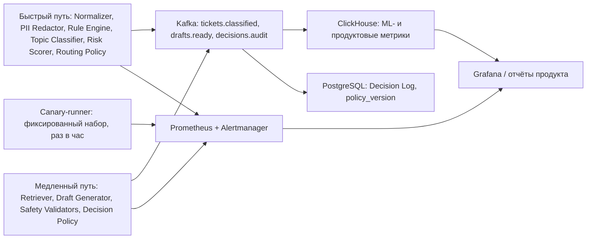

# Мониторинг и наблюдаемость Triage Gateway

Документ описывает, что и как измеряется в эксплуатации: технические метрики двух путей,
ML-метрики онлайн, продуктовые метрики и guardrails, стартовый набор алертов, отделение
деградации модели от изменения входящего потока, контроль стоимости LLM и подтверждение того,
что исходная задача (снижение нагрузки на операторов) действительно решается.

Компоненты, таксономия классов, пороги решения и продуктовая математика — из
[architecture.md](architecture.md), [ml.md](ml.md), [product.md](product.md).
Все числа ниже — **целевые пороги и правила измерения**, а не достигнутые значения.

**Assumption (стек):** технические метрики — Prometheus + Alertmanager, дашборды — Grafana;
трейсы — OpenTelemetry (trace_id прошивается через `Ticket Envelope` и Kafka-заголовки);
продуктовые и ML-метрики — ClickHouse, материализуемый из топиков `decisions.audit` и
`drafts.ready`. В PoC ничего из этого нет (см. раздел «Что есть в PoC»).

## 1. Контур телеметрии

Каждая запись `Decision Log` содержит: `ticket_id`, `trace_id`, `topic`, `p_topic`, `risk`,
`route`, `groundedness`, `retrieval_top1_score`, `policy_version`, версии модели и эмбеддера,
флаги `low_confidence` / `pii_found` / `injection_detected`, длительности стадий. Без этих полей
метрики ниже посчитать нельзя — схема лога является частью контракта мониторинга.

## 2. Технические метрики

### 2.1 Быстрый путь (бюджет 500 мс p95)

| Метрика | Разрез | Цель | Окно |
|---|---|---|---|
| Latency end-to-end p50 | канал, версия модели | ≤ 150 мс | 5 мин |
| Latency end-to-end p95 | канал | ≤ 500 мс (бюджет кейса) | 5 мин |
| Latency end-to-end p99 | канал | ≤ 1200 мс | 15 мин |
| Latency по стадиям p95 | normalize / redact / rules / embed / head / risk+policy / publish | по разбивке бюджета из [architecture.md](architecture.md) | 5 мин |
| Error rate (5xx + внутренние исключения) | канал, стадия | ≤ 0.5 % | 5 мин |
| Throughput | канал | до 35 rps sustained (пик кейса ~33 rps) | 1 мин |
| Насыщение | CPU, RSS, длина пула ONNX-сессий | ≤ 70 % CPU до автоскейла | 5 мин |
| Outbox lag (асинхронная запись в Postgres) | — | ≤ 30 с | 5 мин |

Стадия `embed` (ONNX, CPU) — главный расходный элемент бюджета, поэтому её p95 отслеживается
отдельно от общего: рост только на ней означает проблему инференса, а не сети.

### 2.2 Медленный путь и инфраструктура

- **Kafka consumer lag** по каждому топику: в сообщениях и в секундах (lag / текущий rps).
  Целевое — ≤ 120 с по `tickets.classified`; при инциденте допускается рост с включением shed.
- **Длины очередей операторов** (`L1_general`, `L1_billing`, `L2_tech`, `FRAUD_TEAM`, `LEGAL_DPO`,
  `VIP`): размер, время ожидания p50/p95, число тикетов с < 5 мин до SLA-breach.
- **Доступность LLM**: success rate вызовов, latency p95 генерации, доля таймаутов и retry,
  раздельно для self-hosted vLLM (Qwen3-8B) и внешнего API.
- **Circuit-breaker state** как отдельная gauge (`0=CLOSED, 1=HALF_OPEN, 2=OPEN`) на каждую
  зависимость: LLM self-hosted, LLM внешний, Retriever (OpenSearch + вектор), helpdesk API,
  биллинг, статус-паж. Дополнительно — счётчик переходов в OPEN за сутки и суммарное время в OPEN.
- **Срабатывание запасных путей** (счётчики): rules-only routing из-за недоступности классификатора,
  шаблонный ответ вместо генерации, отказ от генерации из-за недоступного Retriever, shed
  черновиков при лаге, `INCIDENT_BROADCAST`. Тихая деградация без всплеска ошибок — самый
  опасный сценарий, поэтому эти счётчики выведены на главный дашборд.
- **Доступность самого сервиса**: успешные ответы быстрого пути / все запросы. **Assumption:**
  целевая доступность 99.9 % месячно для быстрого пути, 99.5 % для генерации черновиков.

## 3. ML-метрики в эксплуатации

Считаются в ClickHouse по `decisions.audit`, с разбивкой по каналу, теме, `policy_version`
и версии модели (это обязательные разрезы: без них релиз не отличить от потока).

| Метрика | Как считаем | Целевое поведение | Окно |
|---|---|---|---|
| Распределение предсказанных классов | доля каждого из 13 классов | отклонение ≤ 30 % отн. к 7-дневной базе | 1 ч / 24 ч |
| Доля `other` | самостоятельный индикатор нового типа обращений | ≤ 1.5× медианы за 7 дней | 1 ч |
| Уверенность | средняя и квантили p10/p50/p90 `p_topic` | без сдвига медианы > 0.05 | 1 ч |
| Доля abstain / `low_confidence` | тикеты, ушедшие оператору по abstain-политике | ≤ 2× медианы за 7 дней | 1 ч |
| Calibration drift | ECE на «золотом» наборе и на размеченном срезе обратной связи оператора | ECE ≤ 0.05, иначе — перекалибровка temperature scaling | неделя |
| Groundedness черновиков | распределение и доля ниже порога 0.75 | доля `groundedness < 0.75` не растёт > 1.5× базы | 1 ч / 24 ч |
| `retrieval_top1_score` | распределение, доля ниже 0.55 | рост доли ниже порога = проблема KB/индекса | 1 ч |
| **Доля отклонённых операторами черновиков** | `rejected / (accepted + edited + rejected)` | ключевой online-прокси качества; цель — снижение неделя к неделе | 4 ч / неделя |
| Доля отредактированных черновиков и глубина правки | edit distance по нормализованному тексту | глубокие правки = черновики формально валидны, но бесполезны | неделя |
| Точность автозакрытий по реопенам | reopen rate по `AUTO_CLOSE` в срезе 7 суток после закрытия | ≤ 12 %, стоп при 15 % | 24 ч rolling |
| Согласие модели с оператором | доля совпадений темы и маршрута с итоговым решением оператора | базовая линия снимается в shadow-режиме | неделя |
| Срабатывания Safety Validators | PII-в-черновике, prompt injection, обещание денежных операций | любой пропуск в отправленный ответ = S1 | 1 ч |

Отклонённые и исправленные черновики уходят в датасет обратной связи и раз в неделю — в
переобучение головы классификатора (см. [ml.md](ml.md)); тикеты с `low_confidence` отбираются
uncertainty sampling на разметку. Мониторинг здесь — вход в обучающий цикл, а не только дашборд.

## 4. Продуктовые метрики и guardrails

**North Star:** доля тикетов, закрытых без оператора при CSAT ≥ 4.2 и reopen ≤ 12 %
(auto-resolution rate «качественная» — в числитель попадают только автозакрытые тикеты,
которые не переоткрылись). Считается ежедневно, решения принимаются по недельному окну.

| Метрика | Цель | Порог автостопа | Окно измерения | Мин. выборка |
|---|---|---|---|---|
| Качественная auto-resolution rate | плановая траектория раскатки из [product.md](product.md) | — | 7 дней | — |
| Reopen rate по автозакрытым | ≤ 12 % | 15 % → стоп раскатки | 24 ч rolling, реопен считается 7 суток после закрытия | 200 автозакрытий |
| CSAT | ≥ 4.2 | 4.0 → стоп | 7 дней | 200 оценок |
| SLA breach rate (первый ответ 15 мин) | ≤ 3 % (текущий уровень как база) | > 3 % устойчиво | 24 ч | — |
| Доля «плохих» автоответов (safety-инциденты) | 0 критичных, ≤ 0.1 % всего | 1 критичный → стоп | непрерывно | — |

**Assumption:** реопен фиксируется в течение 7 суток после закрытия; CSAT собирается опросом
после закрытия, response rate неизвестен, поэтому у guardrail есть требование минимальной
выборки — иначе шум на малых объёмах будет постоянно триггерить автостоп.

Автостоп реализуется kill-switch по `policy_version`: `AUTO_CLOSE` отключается, все тикеты
переводятся в `SUGGEST_TO_OPERATOR` / `ROUTE_TO_QUEUE`. Возврат раскатки — только вручную
после разбора, с записью решения в лог версий политики.

## 5. Стартовые алерты

Severity (**Assumption**): S1 — вызов on-call круглосуточно, реакция 15 мин; S2 — реакция 1 ч
в рабочие часы; S3 — тикет в бэклог, разбор в течение рабочего дня.

| # | Алерт | Условие | Окно | Sev | Реагирует | Первое действие |
|---|---|---|---|---|---|---|
| 1 | Fast path вне бюджета | p95 > 500 мс ИЛИ p99 > 1200 мс | 10 мин | S2 | backend | Проверить p95 стадии `embed` и автоскейл; при p95 > 800 мс включить rules-only routing |
| 2 | Ошибки быстрого пути | error rate > 1 % | 5 мин | S1 | backend | Определить стадию по метке, откатить последний релиз |
| 3 | Kafka lag медленного пути | lag > 300 с по `tickets.classified` | 10 мин | S2 | backend + DevOps | Включить shed: черновики только для топ-категорий инцидента |
| 4 | LLM недоступен | circuit breaker LLM в OPEN | 5 мин | S2 | backend + ML | Проверить vLLM/внешний API; убедиться, что идёт шаблонный ответ по KB и SLA-таймеры целы |
| 5 | Retriever недоступен | circuit breaker Retriever в OPEN | 5 мин | S2 | backend | Убедиться, что генерация остановлена (без опоры не генерируем), тикеты идут в маршрут |
| 6 | Всплеск abstain | доля `low_confidence` > 2× медианы 7 дней | 1 ч | S3 | ML-инженер | Сверить с canary (раздел 6) и со статус-пажем |
| 7 | Провал на canary-наборе | точность на canary ниже зафиксированной базы на > 5 п.п., 2 прогона подряд | 2 ч | S2 | ML-инженер | Откат версии модели/эмбеддера или `policy_version` |
| 8 | Дрейф входного потока | PSI по эмбеддингам > 0.25 или доля `other` > 1.5× медианы | 1 ч | S3 | ML + data-аналитик | Проверить статус-паж и новые каналы/релизы продукта; при подтверждении — досэмплировать разметку |
| 9 | Падение groundedness | доля черновиков с `groundedness < 0.75` > 1.5× базы | 1 ч | S2 | ML-инженер | Проверить свежесть KB-индекса и `retrieval_top1_score` |
| 10 | Операторы отклоняют черновики | доля отклонений > 35 % (**Assumption** порога до shadow-замера) | 4 ч | S2 | тимлид поддержки + ML | Выборочно прочитать 20 отклонённых, при системной ошибке — сузить категории suggest |
| 11 | **Guardrail-автостоп раскатки** | reopen по автозакрытым ≥ 15 % (≥ 200 автозакрытий) ИЛИ CSAT ≤ 4.0 (≥ 200 оценок) ИЛИ SLA breach > 3 % | 24 ч / 7 дней | S1 | продакт + тимлид поддержки | Kill-switch `AUTO_CLOSE` срабатывает автоматически; человек только подтверждает и открывает разбор |
| 12 | Safety-инцидент | PII в отправленном ответе, ИЛИ hard-deny категория попала в `AUTO_CLOSE`, ИЛИ пропущенный prompt injection — 1 событие | немедленно | S1 | ML + тимлид поддержки | Полный стоп автозакрытия, ручная ревизия затронутых тикетов по `Decision Log` |
| 13 | Стоимость / аномалия токенов | ₽/сутки > 120 % бюджета ИЛИ токены на тикет p95 > 1.5× медианы 7 дней | 1 ч | S2 | ML + DevOps | Проверить признаки зацикливания и prompt injection, урезать контекст, включить degrade (раздел 7) |
| 14 | Очередь на грани SLA | > 200 тикетов с < 5 мин до breach в любой очереди | 15 мин | S2 | тимлид поддержки | Перераспределить операторов; проверить, не деградировала ли маршрутизация |

Алерты 7, 11 и 12 — блокирующие для раскатки: пока они активны, переход на следующий этап
плана (shadow → suggest → auto-close 5/25/100 %) запрещён.

## 6. Деградация модели или изменение потока

Это отдельная задача мониторинга: ML-метрика падает и при поломке модели, и при том, что
пришёл другой поток тикетов. Реакция в этих двух случаях противоположна (откат релиза против
дозаливки разметки), поэтому нужен сигнал, который не зависит от потока.

**Сигналы по входу (меняется поток):**
- **PSI и KL по входным эмбеддингам**: базовое распределение фиксируется на «золотом» holdout
  (5k тикетов), эмбеддинги квантуются по 64 кластерам k-means, зафиксированным при снятии базы;
  PSI считается по этим бинам ежечасно. **Assumption:** порог 0.1 — наблюдение, 0.25 — алерт.
- **PSI по n-граммам**: char 3–5 TF-IDF, топ-5000 признаков — ловит лексические сдвиги
  (новый релиз мобильного приложения, новый тариф, новая формулировка ошибки), которые
  эмбеддинги могут сгладить.
- **Доля OOD**: расстояние до ближайшего базового центроида выше p99 базы.
- **Доля `other`** и рост доли abstain — прикладные индикаторы того же самого.
- **Внешний статус-паж**: если скачок PSI совпадает с активным инцидентом, это поток, а не модель;
  инцидент-режим должен объяснять всплеск `tech.service_unavailable` и рост near-duplicate кластеров.

**Сигналы по модели (меняется модель или инфраструктура вывода):**
- **Canary-набор**: **Assumption:** 300 фиксированных тикетов (стратифицированы по 13 классам,
  с досэмплированием risky-классов), с эталонными метками, PII-редактированные, **неизменяемые**.
  Прогоняются каждый час через тот же путь, что и продакшн (тот же ONNX-артефакт, тот же
  препроцессинг, та же `policy_version`). Вход зафиксирован, поэтому изменение метрики на canary
  однозначно означает изменение системы: новая версия модели, битый экспорт/квантование, другой
  препроцессинг, обрезка текста, сломанный редактор PII. Набор пересобирается только явным
  решением с новой базовой линией и записью в лог версий.
- **Стратифицированный контроль на «золотом» наборе**: тот же holdout 5k, macro-F1 и per-class
  recall на risky-классах — прогон при каждом релизе модели или политики, а не по расписанию.
- **Технические маркеры релиза**: версия модели/эмбеддера/политики как обязательный разрез всех
  ML-метрик; изменение метрики строго по границе деплоя — это модель.

**Матрица разбора:**

| Canary | Дрейф входа (PSI/OOD/`other`) | Вывод | Действие |
|---|---|---|---|
| ОК | высокий | Изменился поток | Проверить статус-паж и релизы продукта, досэмплировать разметку, перекалибровать пороги |
| Провал | низкий | Деградировала модель/инфраструктура | Откат версии модели или `policy_version`, разбор экспорта ONNX и препроцессинга |
| Провал | высокий | Совпали релиз и сдвиг потока | Сначала откат (быстро обратимо), затем разбор потока |
| ОК | низкий, но качество упало | Проблема вне модели | Смотреть KB (устарела статья), Retriever, интеграции, поведение операторов |

## 7. Стоимость LLM

| Метрика | Разрез | Цель / правило |
|---|---|---|
| ₽ на тикет | все тикеты и отдельно тикеты с генерацией | целевое значение — из расчёта в [product.md](product.md), не пересчитывается вручную |
| ₽ в сутки | self-hosted / внешний API | дневной лимит из бюджета в [product.md](product.md) |
| Токены на тикет | вход/выход, p50/p95 | базовая линия — 1800 вх. + 350 исх. токенов; p95 > 1.5× медианы = алерт |
| Доля каскада во внешнем API | по объёму токенов | ≤ 15 % (остальное закрывает self-hosted Qwen3-8B) |
| Cache-hit по семантическому хешу (Redis) | тема, инцидент-режим | **Assumption:** ≥ 25 % в обычном режиме, кратно выше в инцидент-режиме |
| Экономия дедупликации | сэкономленные генерации на `INCIDENT_BROADCAST` | измеряется отдельно: в инциденте это основной рычаг стоимости |
| Использование бюджета | % дневного лимита, скорость расхода | soft 80 % / hard 100 % |

Счётчики бюджета живут в Redis (см. [architecture.md](architecture.md)) и инкрементируются
до вызова LLM, поэтому лимит работает на входе, а не постфактум.

**Что происходит при исчерпании:**
1. **80 % дневного лимита** — отключается reranker, сокращается контекст (меньше пассажей),
   внешний API остаётся только для `ESCALATE_L2`.
2. **100 % лимита внешнего API** — внешний API отключается полностью, весь трафик генерации
   идёт на self-hosted.
3. **100 % общего лимита** — жёсткий degrade: генерация останавливается, `AUTO_CLOSE`
   недоступен (без черновика он невозможен по политике), всё уходит в `SUGGEST_TO_OPERATOR`
   без черновика и `ROUTE_TO_QUEUE`. Тикеты не теряются, SLA-таймеры не ломаются, деградация
   видна как явное событие в `Decision Log`, а не как рост ошибок.

Аномальный рост токенов на тикет — не только вопрос денег: это основной дешёвый детектор
prompt injection (попытка вытянуть длинный ответ) и зацикливания генерации. Поэтому алерт 13
идёт в ML, а не только в DevOps, и разбирается вместе с логом Safety Validators.

## 8. Решается ли исходная задача

Технические и ML-метрики отвечают на вопрос «модель работает», но не на вопрос «нагрузка на
операторов снизилась». Для второго измеряются операционные метрики поддержки:

| Метрика | Как считаем | Направление | Окно |
|---|---|---|---|
| Тикетов на оператора в смену | закрытые тикеты / отработанные смены | рост | неделя |
| Handle time (AHT) | медиана и p90 времени работы над тикетом; база — 8 мин / 150 ₽ | снижение, для suggest-режима ориентир из [product.md](product.md) | неделя |
| Время до первого ответа (TTFR) | p50/p90 и доля > 15 мин | снижение | 24 ч / неделя |
| Backlog и переработки | размер очереди на конец смены, часы сверх нормы | снижение | неделя |
| Доля тикетов, дошедших до оператора | 1 − качественная auto-resolution rate | снижение | неделя |
| Стоимость обработки тикета | ₽ оператора + ₽ LLM + rework по реопенам | снижение | месяц |

**A/B и holdback.** Сравнение «до/после» непригодно: поток сезонный и рвётся инцидентами.
Поэтому:
- **Holdback 5 % трафика** обрабатывается всегда без автоматизации: ни `AUTO_CLOSE`, ни черновиков
  оператору. Назначение — по стабильному хешу `ticket_id` (стратифицировано по каналу и теме),
  группа фиксирована и не пересматривается при раскатке. При 200k тикетов/сутки это ≈10k тикетов
  в сутки — достаточная выборка для недельного чтения по TTFR/AHT и для CSAT/reopen.
- **Holdback остаётся включённым и после 100 % раскатки** — это постоянный измеритель causal-эффекта
  и одновременно контрольная линия для guardrails: если reopen вырос и в holdback, виновата не
  автоматизация, а поток.
- **A/B по этапам раскатки** (suggest на 20 % операторов, auto-close 5 % → 25 % → 100 %):
  рандомизация на уровне оператора для suggest (иначе перенос навыка между группами) и на уровне
  тикета для auto-close. Основные метрики — AHT и TTFR; guardrail-метрики (reopen, CSAT)
  читаются как sequential test с фиксированной минимальной выборкой из раздела 4.
- **Assumption:** решение об эффекте по итогам M3 принимается на недельном окне при
  минимум 2 полных неделях без S1-инцидентов в пилотной группе; ML-эффект не признаётся,
  если он не подтверждён разницей с holdback.

Отдельно фиксируется отрицательный сценарий: если AHT в suggest-группе не падает или растёт
(оператор тратит время на чтение и правку плохого черновика), suggest сужается по категориям,
а не масштабируется. Метрика «доля отклонённых черновиков» из раздела 3 — ранний индикатор
этого до того, как эффект проявится в AHT.

## 9. Что из этого есть в PoC

PoC (см. [architecture.md](architecture.md), раздел о границах реализации) содержит из
мониторинга только фундамент:
- **Структурированный audit-лог**: append-only JSONL с hash-chain (tamper-evident) — каждое
  решение с темой, уверенностью, риском, маршрутом, результатами Safety Validators и порогами
  политики. Это тот же контракт данных, из которого в целевой системе считаются ML- и
  продуктовые метрики.
- **Замер latency быстрого пути в smoke-тесте** — проверка, что путь укладывается в бюджет
  на фикстурах, без нагрузочного профиля и без p99.

Всего остального в коде нет, это дизайн: Prometheus/Grafana, ClickHouse, Kafka-лаг, canary-runner,
PSI/OOD-мониторинг, счётчики бюджета LLM в Redis, A/B-инфраструктура и holdback, автостоп по
guardrails, сбор CSAT и реопенов из helpdesk. PoC не измеряет качество на реальных данных:
классификатор в нём — baseline на 30 фикстурах, LLM — mock.
